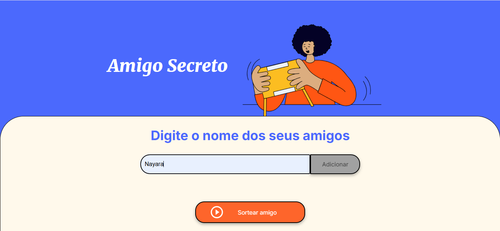
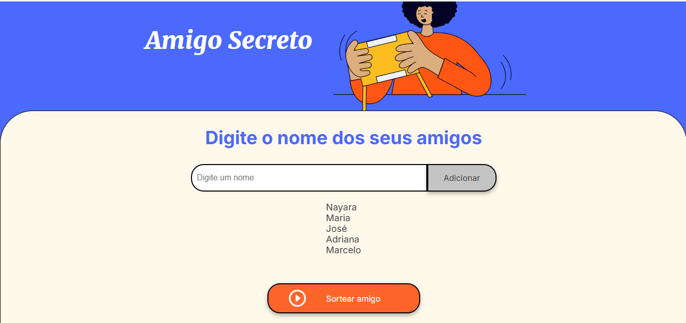
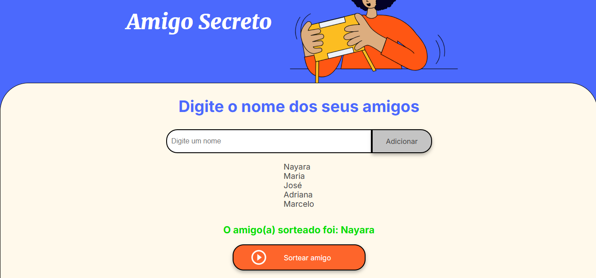

# Challenge Alura Amigo Secreto

## Descrição
Este projeto é um desafio de lógica de programação focado em JavaScript, onde o usuário pode adicionar nomes de amigos a uma lista e, em seguida, sortear um nome aleatório dessa lista. O objetivo principal é praticar o uso de funções, arrays, estruturas condicionais (if/else) e loops (for) em JavaScript.

## Funcionalidades
1. **Adicionar Nomes**: O usuário pode digitar os nomes dos amigos em um campo de entrada e adicioná-los à lista.
2. **Listar Nomes**: Os nomes adicionados são exibidos em uma lista na tela.
3. **Sortear Amigo**: Ao clicar no botão "Sortear Amigo", o programa seleciona um nome aleatório da lista e exibe o resultado.

## Ferramentas Utilizadas
- **HTML**: Para a estrutura da página web. (Modelo disponibilizado pela ALURA)
- **CSS**: Para estilizar a interface. (Modelo disponibilizado pela ALURA)
- **JavaScript**: Para a lógica de programação, incluindo manipulação de arrays, funções, e eventos.

## Como Usar
1. Digite o nome de um amigo no campo de entrada e clique em "Adicionar" para incluí-lo na lista.
2. Repita o processo para adicionar quantos amigos desejar.
3. Clique no botão "Sortear Amigo" para selecionar um nome aleatório da lista.

## Imagens

## Challenge de Estudo
Este projeto foi desenvolvido como parte de um desafio de estudo em lógica de programação com foco em JavaScript. O objetivo é aprimorar as habilidades de programação e entender melhor como manipular arrays, funções, e eventos em JavaScript.

## Autor
Feito por [Seu Nome] - Estudante de Programação.
